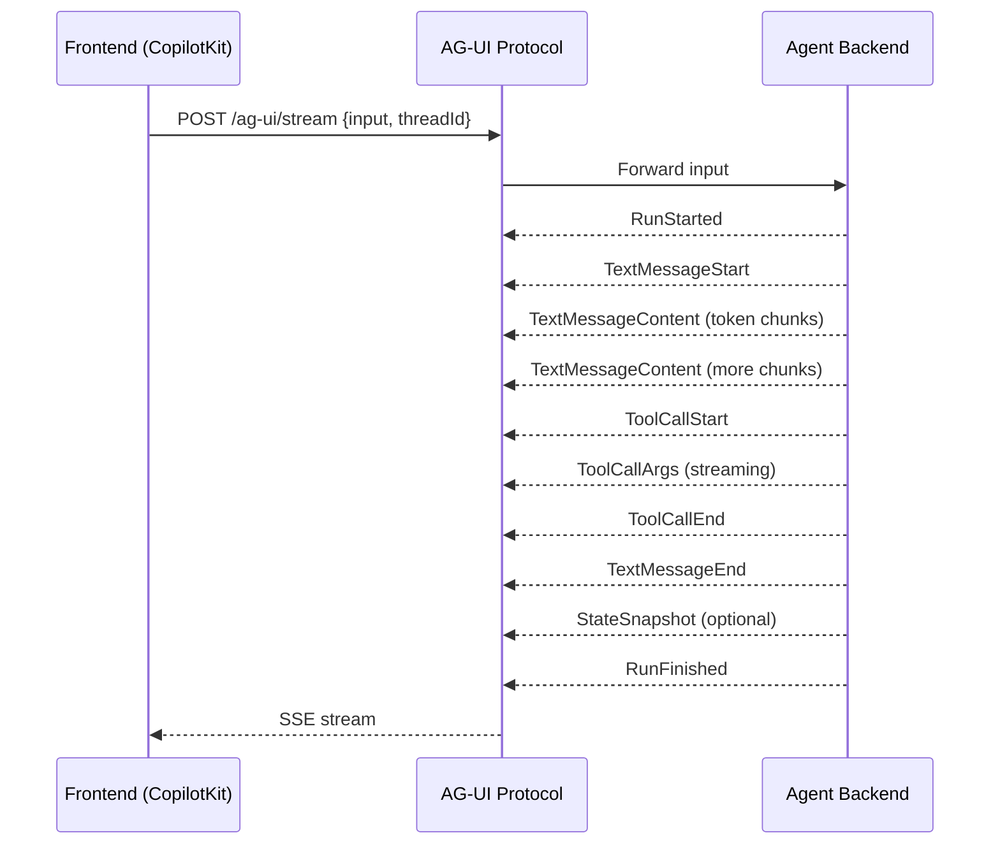

# AG-UI Research Spike: Multi-Framework Agent Integration

## 🎯 Research Objective

Assess whether **AG-UI** (Agentic UI protocol) is usable, performant, and flexible enough to serve as a common UX layer for agentic applications built with different underlying agent frameworks.

### Hypothesis
AG-UI can provide a unified interface layer that works seamlessly across:
- **LangChain / LangGraph**
- **Mastra**
- **CrewAI**
- **LlamaIndex** (optional)

---

## 📋 Research Method

### Phase 1: Baseline Setup ✅
1. ✅ Set up minimal AG-UI demo using CopilotKit + LangGraph
2. ✅ Connect to a reference backend (LangGraph agent on port 8123)
3. ✅ Verify streaming, tool invocation, and state sync work

### Phase 2: Multi-Framework Integration (In Progress)
1. Build standalone backends for each framework
2. Create AG-UI protocol adapters for each
3. Wire them to the frontend via HTTP/SSE

### Phase 3: Testing & Benchmarking
1. Test user interaction features:
   - Token-by-token streaming
   - Real-time context updates
   - Tool invocation via UI
   - Multi-turn conversations
   - UI state synchronization
2. Benchmark performance:
   - Latency (first token, total response time)
   - Event overhead
   - Memory/CPU usage
   - Developer effort (lines of adapter code)

### Phase 4: Documentation & Analysis
1. Document gaps and mismatches between AG-UI and each framework
2. Identify required middleware/bridging logic
3. Note missing event types or protocol features
4. Provide recommendations

---

## 🏗️ Project Structure

```
research-spike/
├── README.md                          # This file
├── my-ag-ui-app/                      # Main AG-UI + CopilotKit frontend
│   ├── apps/
│   │   ├── app/                       # Next.js frontend (port 3000)
│   │   │   └── src/app/api/copilotkit/
│   │   │       ├── route.ts           # CopilotKit runtime endpoint
│   │   │       └── ag-ui-middleware.ts # AG-UI middleware config
│   │   ├── agent/                     # LangGraph Python agent (port 8123)
│   │   │   ├── main.py                # Agent definition
│   │   │   ├── pyproject.toml         # Python dependencies
│   │   │   └── src/
│   │   │       ├── todos.py           # Todo management tools
│   │   │       └── query.py           # Data query tool
│   │   └── mcp/                       # MCP server example (port 3108)
│   ├── .env                           # Environment variables (API keys)
│   └── package.json                   # Monorepo config (Turborepo)
├── backends/                          # Standalone agent backends
│   ├── langchain-backend/             # LangChain standalone (port 8124)
│   │   ├── main.py
│   │   ├── ag_ui_adapter.py
│   │   └── pyproject.toml
│   ├── mastra-backend/                # Mastra TypeScript (port 8125)
│   │   ├── src/
│   │   │   ├── index.ts
│   │   │   ├── agent.ts
│   │   │   └── ag-ui-adapter.ts
│   │   ├── package.json
│   │   └── tsconfig.json
│   ├── crewai-backend/                # CrewAI Python (port 8126)
│   │   ├── main.py
│   │   ├── ag_ui_adapter.py
│   │   └── pyproject.toml
│   └── shared/
│       └── test-prompts.json          # Common test prompts
└── shared/                            # Shared utilities and docs
```

---

## 🚀 Setup Instructions

### Prerequisites

| Tool | Required Version | Check Command | Install |
|------|-----------------|---------------|---------|
| **Node.js** | 18+ | `node --version` | [nodejs.org](https://nodejs.org) |
| **pnpm** | 9+ | `pnpm --version` | `npm install -g pnpm@9` |
| **Python** | 3.12+ | `python --version` | [python.org](https://python.org) |
| **uv** | latest | `uv --version` | `pip install uv` or [astral.sh/uv](https://astral.sh/uv) |

### Step 1: Clone and Install Dependencies

```bash
# Navigate to the project
cd research-spike/my-ag-ui-app

# Install Node.js dependencies (this also runs uv sync for Python)
pnpm install
```

### Step 2: Configure Environment Variables

Create a `.env` file in `my-ag-ui-app/`:

```bash
cd my-ag-ui-app
cp .env.example .env
```

Edit `.env` and add your API keys:

```env
OPENAI_API_KEY=sk-proj-your-key-here
LANGSMITH_API_KEY=lsv2_pt_your-key-here
LANGGRAPH_DEPLOYMENT_URL=http://localhost:8123
MCP_SERVER_URL=http://localhost:3108/mcp
```

**⚠️ Important:** 
- No spaces after `=` in the `.env` file
- Never commit `.env` to git (it's in `.gitignore`)
- Rotate any keys that were accidentally exposed

### Step 3: Start the Development Servers

```bash
# From my-ag-ui-app directory
pnpm dev
```

This starts:
- **Next.js frontend** on `http://localhost:3000`
- **LangGraph agent** on `http://localhost:8123`
- **MCP server** on `http://localhost:3108`

**Troubleshooting:**
- If you see a Turborepo TUI dashboard, that's normal — the servers are running in the background
- If port 3000 is in use, Next.js will use 3001 automatically
- Check `http://localhost:3000` in your browser to verify the UI loads

### Step 4: Verify the Agent Works

1. Open `http://localhost:3000` in your browser
2. You should see the CopilotKit chat interface with a todo canvas
3. Try sending a message: "Create a todo for buying groceries"
4. The agent should respond with streaming text and update the canvas

**If you get "Run ended without emitting a terminal event":**
- Check that the model in [`apps/agent/main.py`](my-ag-ui-app/apps/agent/main.py:23) is set to a model you have access to (e.g., `gpt-4o`, `gpt-4o-mini`)
- Verify your `OPENAI_API_KEY` is valid
- Check the agent logs in the Turborepo TUI

---

## 🔌 AG-UI Protocol Overview

AG-UI uses **Server-Sent Events (SSE)** to stream agent responses to the frontend. The key event types are:



### Event Types

| Event | Purpose | Required Fields |
|-------|---------|----------------|
| `RunStarted` | Signals the start of an agent run | `runId`, `threadId`, `timestamp` |
| `TextMessageStart` | Begins a new message | `messageId`, `role`, `timestamp` |
| `TextMessageContent` | Streams text tokens | `messageId`, `delta` |
| `TextMessageEnd` | Ends a message | `messageId` |
| `ToolCallStart` | Agent invokes a tool | `toolCallId`, `toolCallName`, `parentMessageId` |
| `ToolCallArgs` | Streams tool arguments | `toolCallId`, `argsJson` |
| `ToolCallEnd` | Tool execution complete | `toolCallId`, `result` |
| `StateSnapshot` | Syncs agent state to UI | `snapshot` (arbitrary JSON) |
| `RunFinished` | Agent run complete | `runId`, `threadId`, `timestamp` |

---

## 🧪 Testing Checklist

### Functional Tests

| Test | What to Measure | How to Test |
|------|----------------|-------------|
| **Streaming** | Token-by-token delivery | Watch network tab for SSE events; verify no buffering |
| **Tool invocation** | Tool call → result round-trip | Ask "What's the weather in NYC?" |
| **Multi-turn** | Context preservation | Ask follow-up questions without repeating context |
| **State sync** | UI reflects agent state | Check `StateSnapshot` events in network tab |
| **Error handling** | Graceful degradation | Kill a backend mid-stream; check error display |
| **Reconnection** | Recovery after disconnect | Disconnect network briefly; verify reconnect |

### Performance Benchmarks

| Metric | Target | How to Measure |
|--------|--------|----------------|
| **First token latency** | < 500ms | Time from request to first `TextMessageContent` |
| **Total response time** | < 5s for simple queries | Time from `RunStarted` to `RunFinished` |
| **Event overhead** | < 10% of response time | Compare direct LLM call vs. AG-UI wrapped |
| **Memory usage** | < 200MB per backend | OS task manager during load |
| **CPU usage** | < 50% on 4-core machine | OS task manager during load |

### Developer Experience

| Metric | Target | How to Measure |
|--------|--------|----------------|
| **Adapter code** | < 200 lines per framework | Count lines in `ag_ui_adapter.py` / `.ts` |
| **Setup time** | < 30 minutes | Time from clone to first working agent |
| **Documentation clarity** | 4/5 rating | Self-assessment after setup |

---

## 📊 Current Status

### ✅ Completed
- [x] Set up AG-UI + CopilotKit frontend
- [x] Configured LangGraph agent backend
- [x] Verified streaming and tool invocation work
- [x] Fixed model configuration (changed from `gpt-5.2` to `gpt-4o`)
- [x] Created project structure and documentation

### 🚧 In Progress
- [ ] Build standalone LangChain backend (port 8124)
- [ ] Build Mastra backend (port 8125)
- [ ] Build CrewAI backend (port 8126)
- [ ] Create benchmark test page
- [ ] Wire all backends to frontend

### 📝 Pending
- [ ] Run functional tests across all frameworks
- [ ] Collect performance benchmarks
- [ ] Document gaps and mismatches
- [ ] Write final research report

---

## 🔧 Next Steps

### Phase 2A: Build LangChain Standalone Backend

Create `backends/langchain-backend/` with:
1. `pyproject.toml` — Python dependencies
2. `main.py` — FastAPI server with AG-UI SSE endpoint
3. `ag_ui_adapter.py` — Converts LangChain events to AG-UI events

**Key challenge:** LangChain's `astream_events` API needs to be mapped to AG-UI event types.

### Phase 2B: Build Mastra Backend

Create `backends/mastra-backend/` with:
1. `package.json` — TypeScript dependencies
2. `src/index.ts` — Express server with AG-UI SSE endpoint
3. `src/agent.ts` — Mastra agent definition
4. `src/ag-ui-adapter.ts` — Converts Mastra events to AG-UI events

**Key challenge:** Mastra is TypeScript-native; test if AG-UI works well with JS/TS backends.

### Phase 2C: Build CrewAI Backend

Create `backends/crewai-backend/` with:
1. `pyproject.toml` — Python dependencies
2. `main.py` — FastAPI server with AG-UI SSE endpoint
3. `ag_ui_adapter.py` — Converts CrewAI events to AG-UI events

**Key challenge:** CrewAI doesn't natively support token-level streaming — need to simulate or document this limitation.

### Phase 3: Create Benchmark Page

Create `my-ag-ui-app/apps/app/src/app/benchmark/page.tsx`:
- Send the same prompts to all backends
- Measure first token time, total time, token count
- Display results in a comparison table
- Export results as JSON for analysis

---

## 📚 Resources

### AG-UI Documentation
- [AG-UI Protocol Spec](https://docs.copilotkit.ai/ag-ui) (if available)
- [CopilotKit Docs](https://docs.copilotkit.ai)
- [MCP Apps Middleware](https://www.npmjs.com/package/@ag-ui/mcp-apps-middleware)

### Framework Documentation
- [LangChain](https://python.langchain.com/)
- [LangGraph](https://langchain-ai.github.io/langgraph/)
- [Mastra](https://mastra.ai/docs)
- [CrewAI](https://docs.crewai.com/)

### Tools
- [Turborepo](https://turbo.build/repo/docs)
- [uv (Python package manager)](https://docs.astral.sh/uv/)
- [pnpm](https://pnpm.io/)

---

## 🐛 Known Issues

### Issue 1: Model Configuration
**Problem:** The default agent was configured to use `gpt-5.2` which doesn't exist.  
**Solution:** Changed to `gpt-4o` in [`apps/agent/main.py`](my-ag-ui-app/apps/agent/main.py:23).  
**Lesson:** Always verify model availability before deployment.

### Issue 2: Turborepo TUI Confusion
**Problem:** The Turborepo TUI dashboard looks like a blank terminal.  
**Solution:** The TUI is working correctly — it shows task status. The actual app runs on `http://localhost:3000`.  
**Lesson:** Document what the TUI looks like so users know what to expect.

### Issue 3: Port Conflicts
**Problem:** If port 3000 is in use, Next.js silently switches to 3001.  
**Solution:** Check the Turborepo TUI or terminal output for the actual port.  
**Lesson:** Make port configuration explicit in `.env`.

---

## 📝 Research Notes

### Observation 1: CopilotKit Integration
CopilotKit provides a high-level abstraction over AG-UI. The [`LangGraphAgent`](my-ag-ui-app/apps/app/src/app/api/copilotkit/route.ts:11) adapter handles most of the protocol translation automatically.

**Implication:** For frameworks without a CopilotKit adapter, we need to implement the AG-UI protocol manually.

### Observation 2: MCP Tools
The agent loads tools from an external MCP server at startup ([`main.py:20`](my-ag-ui-app/apps/agent/main.py:20)). This adds latency and a potential failure point.

**Implication:** For benchmarking, we should test with and without MCP tools to isolate their impact.

### Observation 3: State Management
The [`AgentState`](my-ag-ui-app/apps/agent/src/todos.py:14) TypedDict defines the agent's state schema. This is synced to the UI via `StateSnapshot` events.

**Implication:** Each framework needs a way to serialize its state to JSON for AG-UI.

---

## 🎓 Lessons Learned

1. **Environment setup is critical:** Small issues like spaces in `.env` values or wrong model names can cause cryptic errors.
2. **Turborepo TUI is powerful but confusing:** Users need clear documentation on what to expect.
3. **AG-UI is framework-agnostic:** The protocol is simple enough to adapt to any agent framework, but each requires custom adapter code.
4. **Streaming is non-trivial:** Not all frameworks support token-level streaming natively (e.g., CrewAI).

---

## 📧 Contact

For questions or issues, please open an issue in this repository or contact the research team.

---

## 📄 License

This research spike is for internal evaluation purposes. Code samples are provided as-is for educational use.
